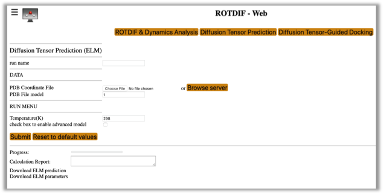
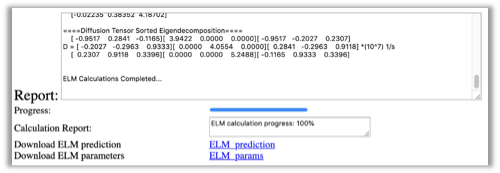

<META http-equiv="Content-Style-Type" content="text/css">
<LINK href="../sassie_style.css" rel="stylesheet" type="text/css"> 

###Diffusion Tensor Prediction Module (ELM)

This module performs ab initio prediction of the rotational diffusion tensor of a macromolecule directly from the atom coordinates using an ellipsoid model (ELM) representation [6].

To select this module from the general ROTDIF-Web page (shown below), click the button “Diffusion Tensor Prediction”

The interface will look like this:

*	**Run name:** The name of the folder to store the results of the current session
*	**PDB Coordinates File:** Upload the coordinates file to be used for diffusion tensor prediction
*	**PDB File model:** If the coordinates file contains more than one structural model, please specify the model you want to analyze. The default model number is 1. 
*	**Temperature:** The desired temperature (in K) of the aqueous medium. Please note that the program assumes that molecule of interest is tumbling in water, and the empirical formula for the water viscosity used here [6, 12] is valid in the range from 273K to 373 K. 
*	**check box to enable advanced model:** These options are designed for advanced adjustment of the hydration layer thickness and the water radius. It is recommended that you use the default values.

Prior to running ELM, please make sure the project name is specified. If it is not specified or you would like to change the project name, click on the “head” icon  in the top right corner. The following selection window will appear:
 

You can select an existing project from the pull-down list or click “New project” and create a new project by providing the project name and the description, for example:
 

Then click the  button. The “Status” information will read like the following:
 

Now you can run Diffusion Tensor Prediction (ELM). Here is an example of input parameters; you can also try other values.
 

Fill out the required fields, shown above, then click the Submit button. After the process has completed, you should be able to see and download a file “ELM prediction” containing the output of the diffusion tensor prediction. The screen output looks like the following:
 

Output files accessible directly from the module GUI:
 
*	Download ELM prediction: ELM_prediction. This output file contains the predicted diffusion tensor. Below is a screenshot of that file.
 

*	Download ELM parameters: ELM_params. This output file contains a record of all input parameters and settings used in the calculation, and it looks like this:
 

###Exercise

This exercise includes prediction of the rotational diffusion tensor for the B3 domain of protein G (GB3). Use atom coordinates file “1P7F.pdb” to run the ELM module. 

###Reference(s) and Citations
1. O. Walker, R. Varadan, D. Fushman,[”Efficient and accurate determination of the overall rotational diffusion tensor of a molecule from 15N relaxation data using computer program ROTDIF,”](https://www.ncbi.nlm.nih.gov/pubmed/15140445) J. Magn. Reson. (2004) 168, 336-345.
2. K. Berlin, A. Longhini, T. K. Dayie, D. Fushman, [“Deriving Quantitative Dynamics Information for Proteins and RNAs using ROTDIF with a Graphical User Interface”,](https://www.ncbi.nlm.nih.gov/pubmed/24170368) J Biomol NMR (2013) 57, 333-352.
3. D. Fushman, S. Cahill, D. Cowburn, [“The main chain dynamics of the dynamin Pleckstrin Homology (PH) domain in solution: Analysis of 15N relaxation with monomer/dimer equilibration,”](https://www.ncbi.nlm.nih.gov/pubmed/9054979) J. Mol. Biol. 266 (1997) 173-194. 
4. J. B. Hall, and D. Fushman, [“Characterization of the overall and local dynamics of a protein with intermediate rotational anisotropy: Differentiating between conformational exchange and anisotropic diffusion in the B3 domain of protein G,“](https://www.ncbi.nlm.nih.gov/pubmed/12975584) J. Biomol. NMR (2003) 27, 261-275. 
5. J. B. Hall, D. Fushman, [“Variability of the 15N chemical shielding tensors in the B3 domain of protein G from 15N relaxation measurements at several fields. Implications for backbone order parameters,”](https://pubs.acs.org/doi/abs/10.1021/ja060406x) J. Am. Chem. Soc. (2006) 128, 7855-70.
6. Y. Ryabov, C. Geraghty, A. Varshney, D. Fushman, [“An efficient computational method for predicting rotational diffusion tensors of globular proteins using an ellipsoid representation,”](https://pubs.acs.org/doi/abs/10.1021/ja062715t) J. Am. Chem. Soc. (2006) 128, 15432-15444.
7. Y. Ryabov, D. Fushman, [“Structural assembly of multidomain proteins and protein complexes guided by the overall rotational diffusion tensor,”](https://www.ncbi.nlm.nih.gov/pubmed/17550252) J. Am. Chem. Soc. (2007) 129, 7894-7902.
8. K. Berlin, D. P. O’Leary, D. Fushman, [“Fast Approximations of the Rotational Diffusion Tensor and their Application to Structural Assembly of Molecular Complexes”,](https://www.ncbi.nlm.nih.gov/pubmed/21604302) Proteins (2011) 79, 2268-2281.
9. R. Varadan, O. Walker, C. Pickart, D. Fushman, [“Structural properties of polyubiquitin chains in solution,”](https://www.ncbi.nlm.nih.gov/pubmed/12460567) J. Mol. Biol. (2002) 324, 637-647
10. D. Fushman, R. Ghose, D. Cowburn, [“The effect of finite sampling on the determination of orientational properties: A theoretical treatment with application to interatomic vectors in proteins,”](https://pubs.acs.org/doi/abs/10.1021/ja001128j) J. Am. Chem. Soc. 122 (2000) 10640-9
11. D. Fushman, [“Determining protein dynamics from 15N relaxation data by using DYNAMICS”,](https://www.ncbi.nlm.nih.gov/pmc/articles/PMC4361738/) in Protein NMR Techniques, Third Edition, Eds. A. Shekhtman, D. S. Burz; Methods in Molecular Biology, 2012, Volume 831, 485-511, Springer Science, DOI: 10.1007/978-1-61779-480-3_24. PubMed: PMC4361738
12. R. C. Weast, [Handbook of Chemistry and Physics](http://hbcponline.com/faces/contents/ContentsSearch.xhtml), 59th ed.; CRC Press: West Palm Beach, FL, 1978.

--
####[Return to Introduction](./rotdif_intro.html)
####[Tutorial of ROTDIF & DYNAMICS](./rotdif_all.html)
####[Tutorial of ELMDOCK](./elmdock.html)  

<a href=#>Return to top</a>

<footer>
  <ul>
  Supported via NSF grants OAC-1739549 (to D.F.) OAC-1740087 (to E.B.) and Science Gateways Community Institute (summer internship to Y.C.)
  </ul>
</footer> 
