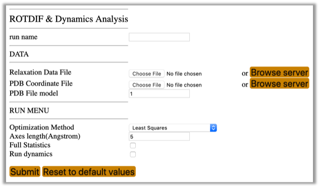
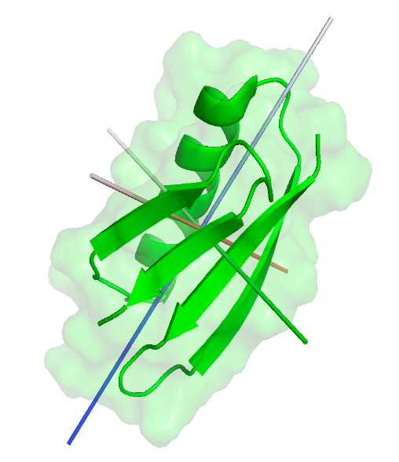
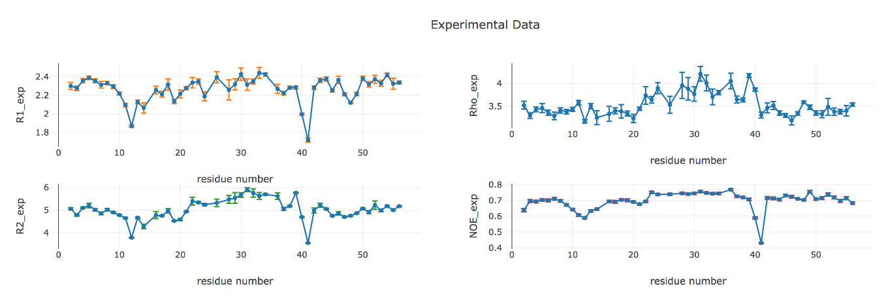
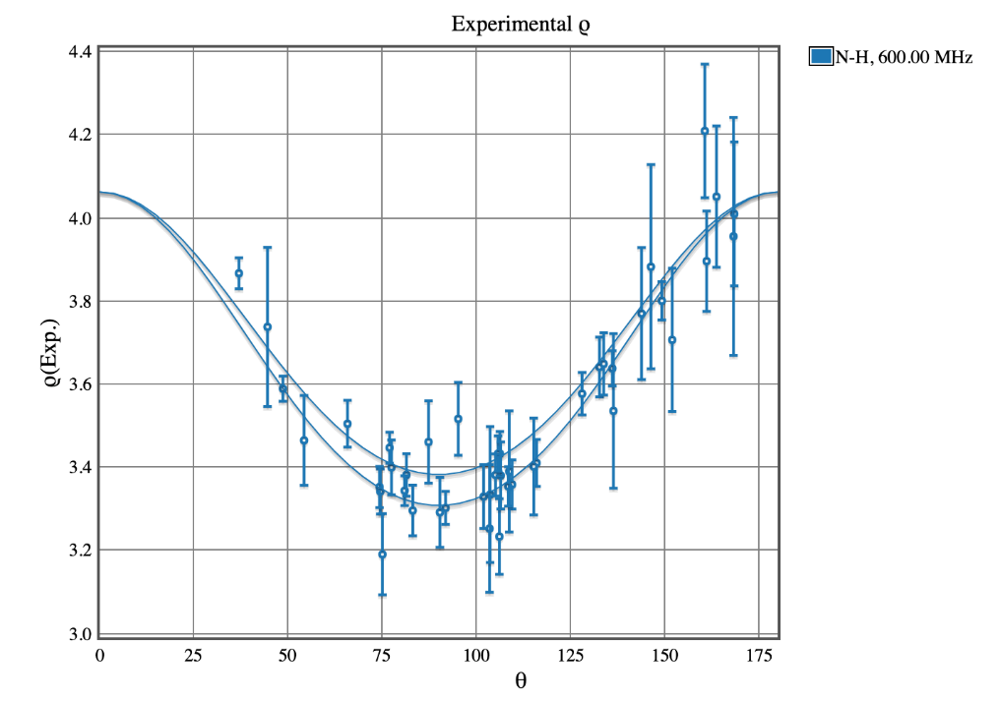
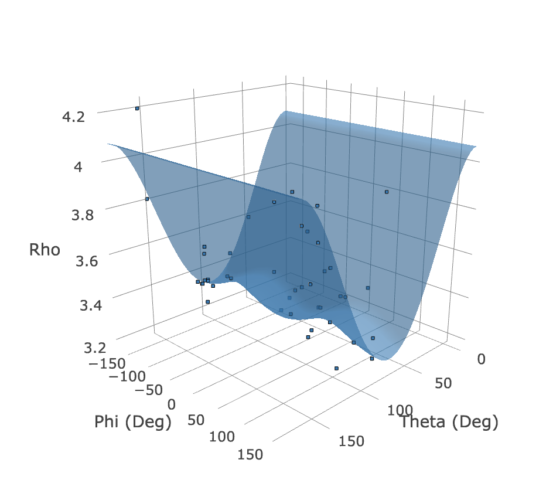
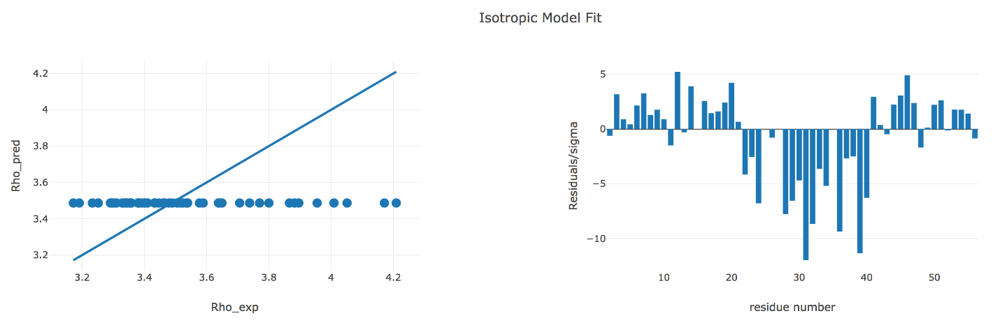
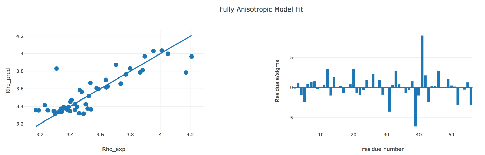

<META http-equiv="Content-Style-Type" content="text/css">
<LINK href="../sassie_style.css" rel="stylesheet" type="text/css"> 

##ROTDIF & Dynamics Analysis Module 

This module allows you to determine the overall rotational diffusion tensor from the experimental spin-relaxation data and to characterize local dynamics in proteins and nucleic acids.

To select this module from the general ROTDIF-Web page (shown below), click the button “ROTDIF & Dynamics Analysis”

The interface will look like this:

*	Run name: The name of the folder to store all the results of the current session
*	Relaxation Data File: Upload the file (e.g., GB3_600_MHz.txt) containing experimental relaxation data. The data file is a text (ascii) file with the following format.
*	Format: 

If the input file includes relaxation data measured at multiple frequencies, please leave a blank line between the data from different fields, as shown below:

Here “A” is the “chainID” in the coordinates file, “frequency” is the 1H frequency of the spectrometer, “N” and “H” indicate the atom pair in which the relaxation of the first one (15N) was measured; R1 and R2 are the longitudinal and transverse, respectively, 15N autorelaxation rates, and NOE is the steady-state heteronuclear 15N{1H} NOE, the columns marked “R1 error” etc. correspond to the errors in the respective experimental data.
If there are unwanted residues in the data file, they can be either removed or commented out by placing % at the very beginning of the corresponding line. Two types of comments can be used: 
% designates residues that should be completely ignored (the same as deleting the line)
* designates residues that should be excluded from the determination of the diffusion tensor but will be used when determining parameters for the local dynamics. 

These are typically residues affected by conformational/chemical exchange (resulting in elevated R2 values) or those residues where the molecular structure is not well defined (e.g., due to increased flexibility or other issues), as well as other outliers. 
An example of comments: 

Prior to running ROTDIF & Dynamics Analysis, please make sure the project name is specified. If it is not specified or you would like to change the project name, click on the “head” icon   in the top right corner. The following selection window will appear: 

*	**PDB Coordinates File:** Upload the atom coordinates file (e.g., 1P7F.pdb).
*	**PDB File model:** If the atom coordinates file contains more than one structural model, please specify the model you want to analyze. The default model number is 1.
*	**Optimization Method: Choose the optimization method:**  ”Least Squares” or  “Robust Least Squares (3.0sig)”. Least Squares is the conventional minimization method, while the Robust Least Squares, introduced in ROTDIF 3, dampens the contributions of residuals that are greater than 3 (above 99.7 percentile)(see our publication [2] for more details).
*	**Axes length:** Please specify according to the size of proteins. The default is 5 Angstrom. This parameter sets the desired length of the diffusion tensor axes, to be stored through the *.py files and visualized in PyMol. If the axis length is too short (shorter than the size of the protein) it might not be clearly visible when shown together with the protein. 
*	**Full Statistics:** Check this box if you want to perform error analysis of the results. The program will generate synthetic (Monte-Carlo) data sets based on the experimental errors in the relaxation rates, for each set perform the same analysis, and produce a full statistics report.
*	**Run Dynamics:** Check this box if you want to perform model-free analysis of internal motions in the protein. 

Prior to running ROTDIF & Dynamics Analysis, please make sure the project name is specified. If it is not specified or you would like to change the project name, click on the “head” icon  in the top right corner. The following selection window will appear:

You can select an existing project from the pull-down list or click “New project” and create a new project by providing the project name and the description, for example: 

Then click the  button. The “Status” information will read like the following: 

Now you can run ROTDIF & Dynamics analysis. Here is an example of input parameters; you can also try other values.   

Fill out the required fields, shown above, then click the Submit button. 
Caution: it may take a long time to run the calculations with “Full Statistics” checked. If this is not necessary, we suggest to leave this box unchecked.

Note: if you upload a different data set after finishing a previous calculation, it might be helpful to click the “Reset to default values” button to clear memory.

After the progress is 100%, you should be able to see all the output files and figures.  

Output files directly accessible/downloadable from the module GUI:
*	Detailed Results File: the rotdif_log.out file contains records of all the data used to generate the plots shown below
*	Saved PyMol Axes for axially symmetric model: the out_axial.py file, when run in PyMol, builds diffusion tensor axes based on the results for the axially symmetric rotational diffusion model  
*	Saved PyMol Axes for fully anisotropic model: the out_ani.py file, when run in PyMol, builds diffusion tensor axes based on the results for the fully anisotropic rotational diffusion model

You can visualize the axes encoded in the *.py files in PyMol together with your protein (outside ROTDIF-Web). The model below was made in PyMol using the results of the fully anisotropic diffusion tensor analysis.

Once the calculation is finished, the program will output the following plots:

Figure 1. Experimental Data.
This plot shows input experimental data (with error bars) as a function of residue number. Shown are data for all residues that are not marked with %. The parameter $\alpha$ represents the ratio of the modified relaxation rates – see [2]. You can use the mouse/cursor to read the values for individual residues. 

Figure 2. Bond Orientations Plot 
This 3D plot shows the distribution of bond orientations (represented by unit vectors) for the residues included in the analysis, to allow visual inspection of how well these vectors sample the orientational space. The sampling tensor quantifying the degree of orientational sampling will be included in the Detailed Results output file. Uniform sampling of the orientations could be important for accurate analysis of the diffusion tensor – see publication [10] for more details. Use the mouse to rotate the plot or zoom.

Figure 3. Chi-square Plot
This 3D plot shows the resulting s^2 value as the function of the Euler angles alpha and beta that determine the orientation of the principal axes of the overall rotational diffusion tensor (axially symmetric model) in the coordinate frame of the protein. Use the mouse to rotate the plot or zoom.  

Figure 4. 2D Model Fit
This 2D plot shows the $\rho$ values for the individual residues as the function of the angle $\rho$ between the corresponding bond and the z-axis of the rotational diffusion tensor (axially symmetric model). The curves represent the upper and lower bounds of the theoretical dependence of $\rho$ as a function $\rho$ for the derived fully anisotropic diffusion tensor (see Figure 5 and publication [1] for details). You can use the mouse/cursor to read the values for individual residues.

Figure 5. 3D Model Fit
This 3D plot shows the $\rho$ values for the individual residues as the function of the angles $\theta$ and $\phi$ that determine the orientation of each bond with respect to the principal axes of the derived rotational diffusion tensor (fully anisotropic model). The surface represents the theoretical dependence of $\rho$ as a function of $\theta$ and $\phi$ for the resulting diffusion tensor; the dots represent experimental data points. Use the mouse to rotate the plot or zoom. You can use the mouse/cursor to read the values for individual data points.

Figure 6. Isotropic Model Fit 
These plots illustrate how well or not the experimental data agree with the isotropic rotational diffusion tensor model. Shown on the left is the agreement between the experimental and back-calculated/predicted values of $\rho$; the line corresponds to absolute agreement. Shown on the right are the normalized residuals of fit for each residue. You can use the mouse/cursor to read the values for individual residues.

Figure 7. Axially Symmetric Model Fit 
These plots illustrate how well or not the experimental data agree with the axially symmetric rotational diffusion tensor model. Shown on the left is the agreement between the experimental and back-calculated/predicted values of ; the line corresponds to absolute agreement. Shown on the right are the normalized residuals of fit for each residue. You can use the mouse/cursor to read the values for individual residues.

Figure 8. Fully Anisotropic Model Fit 
These plots illustrate how well or not the experimental data agree with the fully anisotropic rotational diffusion tensor model. Shown on the left is the agreement between the experimental and back-calculated/predicted values of ; the line corresponds to absolute agreement. Shown on the right are the normalized residuals of fit for each residue. You can use the mouse/cursor to read the values for individual residues.

Figure 9. Dynamics: Isotropic Model
These plots depict the model-free parameters of local motions derived from the experimental data assuming isotropic rotational diffusion tensor model: the squared order parameter (S^2) and the related local correlation time (tau_loc), as well as, when applicable, the squared order parameter for fast motion (S^2_fast) and the conformational exchange contribution (Rex) to R2. See publications [3, 11] for a detailed description of these parameters. You can use the mouse/cursor to read the values for individual residues.

Figure 10. Dynamics: Axially Symmetric Model
These plots depict the model-free parameters of local motions derived from the experimental data assuming axially symmetric rotational diffusion tensor model: the squared order parameter (S^2) and the related local correlation time (tau_loc), as well as, when applicable, the squared order parameter for fast motion (S^2_fast) and the conformational exchange contribution (Rex) to R2. See publications [3, 11] for the details of these parameters. You can use the mouse/cursor to read the values for individual residues.

Figure 11. Dynamics: Fully Anisotropic Model
These plots depict the model-free parameters of local motions derived from the experimental data assuming fully anisotropic rotational diffusion tensor model: the squared order parameter (S^2) and the related local correlation time (tau_loc), as well as, when applicable, the squared order parameter for fast motion (S^2_fast) and the conformational exchange contribution (Rex) to R2. See publications [3, 11] for the details of these parameters. You can use the mouse/cursor to read the values for individual residues.

###Exercise Examples

This exercise includes analysis of 15N relaxation data at three different fields (1H resonance frequencies: 500 MHz, 600 MHz, and 800 MHz). Please use files “1P7F.pdb” and “GB3_3Fields.txt” to run ROTDIF-Web in all applicable modules. You should be able to see plots like these:

--

###Reference(s) and Citations
1. O. Walker, R. Varadan, D. Fushman,[”Efficient and accurate determination of the overall rotational diffusion tensor of a molecule from 15N relaxation data using computer program ROTDIF,”](https://www.ncbi.nlm.nih.gov/pubmed/15140445) J. Magn. Reson. (2004) 168, 336-345.
2. K. Berlin, A. Longhini, T. K. Dayie, D. Fushman, [“Deriving Quantitative Dynamics Information for Proteins and RNAs using ROTDIF with a Graphical User Interface”,](https://www.ncbi.nlm.nih.gov/pubmed/24170368) J Biomol NMR (2013) 57, 333-352.
3. D. Fushman, S. Cahill, D. Cowburn, [“The main chain dynamics of the dynamin Pleckstrin Homology (PH) domain in solution: Analysis of 15N relaxation with monomer/dimer equilibration,”](https://www.ncbi.nlm.nih.gov/pubmed/9054979) J. Mol. Biol. 266 (1997) 173-194. 
4. J. B. Hall, and D. Fushman, [“Characterization of the overall and local dynamics of a protein with intermediate rotational anisotropy: Differentiating between conformational exchange and anisotropic diffusion in the B3 domain of protein G,“](https://www.ncbi.nlm.nih.gov/pubmed/12975584) J. Biomol. NMR (2003) 27, 261-275. 
5. J. B. Hall, D. Fushman, [“Variability of the 15N chemical shielding tensors in the B3 domain of protein G from 15N relaxation measurements at several fields. Implications for backbone order parameters,”](https://pubs.acs.org/doi/abs/10.1021/ja060406x) J. Am. Chem. Soc. (2006) 128, 7855-70.
6. Y. Ryabov, C. Geraghty, A. Varshney, D. Fushman, [“An efficient computational method for predicting rotational diffusion tensors of globular proteins using an ellipsoid representation,”](https://pubs.acs.org/doi/abs/10.1021/ja062715t) J. Am. Chem. Soc. (2006) 128, 15432-15444.
7. Y. Ryabov, D. Fushman, [“Structural assembly of multidomain proteins and protein complexes guided by the overall rotational diffusion tensor,”](https://www.ncbi.nlm.nih.gov/pubmed/17550252) J. Am. Chem. Soc. (2007) 129, 7894-7902.
8. K. Berlin, D. P. O’Leary, D. Fushman, [“Fast Approximations of the Rotational Diffusion Tensor and their Application to Structural Assembly of Molecular Complexes”,](https://www.ncbi.nlm.nih.gov/pubmed/21604302) Proteins (2011) 79, 2268-2281.
9. R. Varadan, O. Walker, C. Pickart, D. Fushman, [“Structural properties of polyubiquitin chains in solution,”](https://www.ncbi.nlm.nih.gov/pubmed/12460567) J. Mol. Biol. (2002) 324, 637-647
10. D. Fushman, R. Ghose, D. Cowburn, [“The effect of finite sampling on the determination of orientational properties: A theoretical treatment with application to interatomic vectors in proteins,”](https://pubs.acs.org/doi/abs/10.1021/ja001128j) J. Am. Chem. Soc. 122 (2000) 10640-9
11. D. Fushman, [“Determining protein dynamics from 15N relaxation data by using DYNAMICS”,](https://www.ncbi.nlm.nih.gov/pmc/articles/PMC4361738/) in Protein NMR Techniques, Third Edition, Eds. A. Shekhtman, D. S. Burz; Methods in Molecular Biology, 2012, Volume 831, 485-511, Springer Science, DOI: 10.1007/978-1-61779-480-3_24. PubMed: PMC4361738
12. R. C. Weast, [Handbook of Chemistry and Physics](http://hbcponline.com/faces/contents/ContentsSearch.xhtml), 59th ed.; CRC Press: West Palm Beach, FL, 1978.

--

####[Return to Introduction](./rotdif_intro.html)
####[Tutorial of ELM](./elm.html)
####[Tutorial of ELMDOCK](./elmdock.html)  

<a href=#>Return to top</a>

<footer>
  <ul>
  Supported via NSF grants OAC-1739549 (to D.F.) OAC-1740087 (to E.B.) and Science Gateways Community Institute (summer internship to Y.C.)
  </ul>
</footer> 
