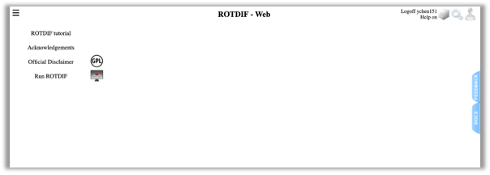
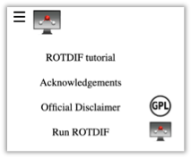

<META http-equiv="Content-Style-Type" content="text/css">
<LINK href="../sassie_style.css" rel="stylesheet" type="text/css"> 

##ROTDIF Introduction

ROTDIF-Web is an online tool that enables researchers to perform accurate and comprehensive analysis of NMR spin-relaxation data. It is developed based on the original programs and software packages ROTDIF, ELM, ELMDOCK, and DYNAMICS developed by David Fushman’s group at the University of Maryland (see References [1-8]). Besides retaining the core features of these programs, data visualization is made available in ROTDIF-Web. ROTDIF-Web is based on the ROTDIF 3 Java version written by Konstantin Berlin -- see publication [2]. The stand-alone Java code is available for download from  Fushman Lab or Armor package. The GenApp adaptation of the Java version was performed by Yuexi Chen with the help from Alexey Savelyev and Emre Brookes. For funding information, please check the “Acknowledgements” on ROTDIF-Web.

ROTDIF-Web includes the following main modules and features:

*	ROTDIF & DYNAMICS: Determine the overall rotational diffusion tensor and characterize local dynamics in proteins and nucleic acids [1-5].
*	ELM predictor: Ab initio prediction of the rotational diffusion tensor of a macromolecule directly from the atom coordinates using an ellipsoid model representation [6].
*	ELMDOCK: Build macromolecular complexes using rigid-body docking guided by experimental rotational diffusion tensors [7,8].  

--

###Preparation
ROTDIF-Web Interface

####Register: 
Before you start this tutorial, you will need to create an account and log in to ROTDIF-Web. To register, please click the “human-head” icon to register as a new user. If you already have an account, please click “Login”. After that, you should see the following webpage and your username will be after “Logoff” at the top right corner.

--

###Tutorial Data
We have provided the following data to help you work through the tutorial and examples. To download these data to your computer, please click the “How to use” option on the left-side bar. For the monomer, these include 15N relaxation data for the B3 domain of protein G (GB3) [4,5]; for the dimer we use artificial 15N relaxation data for K48-linked di-Ubiquitin [9]. Here are the data files. You can download download all sample data as a [single zip file](files/rotdif_materials.zip), or download them separately.
monomer:
A PDB coordinate file of the B3 domain of protein G (GB3): ([1P7F.pdb](files/1P7F.pdb))

A Relaxation Data file containing 15N relaxation data measured at a single magnetic field (1H frequency 600 MHz) [4]: ([GB3-600-MHz.txt](files/GB3_600_MHz.txt))
 
A Relaxation Data file containing 15N relaxation data measured at three magnetic fields [5]: ([GB3-3Fields.txt](files/GB3_3Fields.txt))

dimer:
A coordinate file containing two arbitrarily positioned ubiquitin molecules:  ([diUb_AB.pdb](files/diUb_AB.pdb))
the coordinates for each ubiquitin molecule are from PDB ID 1D3Z.

A Relaxation Data file for ubiquitin dimer: ([diUb-AB-relax.txt](files/diUb_AB_relax.txt))

After downloading these files, you can click the three horizontal lines icon (of the Menu help icon) in the top left corner to show or hide the left-side bar.
To get access to various modules/tools of the ROTDIF package, click “Run ROTDIF” on the left-side bar.

The module-selection horizontal bar will appear that looks like this:

--

###Reference(s) and Citations
1. O. Walker, R. Varadan, D. Fushman,[”Efficient and accurate determination of the overall rotational diffusion tensor of a molecule from 15N relaxation data using computer program ROTDIF,”](https://www.ncbi.nlm.nih.gov/pubmed/15140445) J. Magn. Reson. (2004) 168, 336-345.
2. K. Berlin, A. Longhini, T. K. Dayie, D. Fushman, [“Deriving Quantitative Dynamics Information for Proteins and RNAs using ROTDIF with a Graphical User Interface”](https://www.ncbi.nlm.nih.gov/pubmed/24170368), J Biomol NMR (2013) 57, 333-352.
3. D. Fushman, S. Cahill, D. Cowburn, [“The main chain dynamics of the dynamin Pleckstrin Homology (PH) domain in solution: Analysis of 15N relaxation with monomer/dimer equilibration,”](https://www.ncbi.nlm.nih.gov/pubmed/9054979) J. Mol. Biol. 266 (1997) 173-194. 
4. J. B. Hall, and D. Fushman, [“Characterization of the overall and local dynamics of a protein with intermediate rotational anisotropy: Differentiating between conformational exchange and anisotropic diffusion in the B3 domain of protein G,“](https://www.ncbi.nlm.nih.gov/pubmed/12975584) J. Biomol. NMR (2003) 27, 261-275. 
5. J. B. Hall, D. Fushman, [“Variability of the 15N chemical shielding tensors in the B3 domain of protein G from 15N relaxation measurements at several fields. Implications for backbone order parameters,”](https://pubs.acs.org/doi/abs/10.1021/ja060406x) J. Am. Chem. Soc. (2006) 128, 7855-70.
6. Y. Ryabov, C. Geraghty, A. Varshney, D. Fushman, [“An efficient computational method for predicting rotational diffusion tensors of globular proteins using an ellipsoid representation,”](https://pubs.acs.org/doi/abs/10.1021/ja062715t) J. Am. Chem. Soc. (2006) 128, 15432-15444.
7. Y. Ryabov, D. Fushman, [“Structural assembly of multidomain proteins and protein complexes guided by the overall rotational diffusion tensor,”](https://www.ncbi.nlm.nih.gov/pubmed/17550252) J. Am. Chem. Soc. (2007) 129, 7894-7902.
8. K. Berlin, D. P. O’Leary, D. Fushman, [“Fast Approximations of the Rotational Diffusion Tensor and their Application to Structural Assembly of Molecular Complexes”](https://www.ncbi.nlm.nih.gov/pubmed/21604302), Proteins (2011) 79, 2268-2281.
9. R. Varadan, O. Walker, C. Pickart, D. Fushman, [“Structural properties of polyubiquitin chains in solution,”](https://www.ncbi.nlm.nih.gov/pubmed/12460567) J. Mol. Biol. (2002) 324, 637-647

--

####[Tutorial of ROTDIF & DYNAMICS](./rotdif_all.html)
####[Tutorial of ELM](./elm.html)
####[Tutorial of ELMDOCK](./elmdock.html)  

<a href=#>Return to top</a>

<footer>
  <ul>
  Supported via NSF grants OAC-1739549 (to D.F.) OAC-1740087 (to E.B.) and Science Gateways Community Institute (summer internship to Y.C.)
  </ul>
</footer> 
